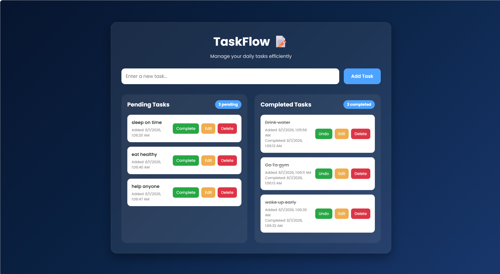

# WebDev-L2-ToDoWebApp

A responsive **To-Do Web Application** developed as **Level 2 - Task 3** for the **Oasis Infobyte Web Development & Designing Internship**.

## Features

* Add new tasks
* Edit existing tasks
* Mark tasks as complete or undo completion
* Delete tasks
* Separate Pending and Completed task lists
* Live pending and completed task counters
* Task timestamps
* Data persistence using Local Storage
* Responsive and modern user interface
* Empty state messages

## Technologies Used

* HTML5
* CSS3
* JavaScript (Vanilla JS)
* Local Storage API

## Project Structure

```text
WebDev-L2-ToDoWebApp/
│── index.html
│── style.css
│── script.js
│── README.md
└── screenshots/
    └── preview.png
```

## Screenshot



## How to Run

1. Clone or download this repository.
2. Open `index.html` in any modern web browser.
3. Start managing your daily tasks.

## Author

**Areesha Khan**
